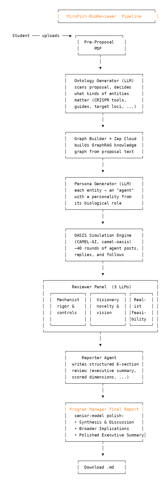

# Easy Start — MiroFish-BioReviewer

A non-technical, no-installation guide to running an AI-assisted review of a systems-biology grant pre-proposal entirely in your web browser. About 60–90 minutes end to end, most of it automated. No coding, no Python, no terminal.

> **Who this guide is for.** Researchers, PIs, postdocs, and program managers who want to put a pre-proposal through the tool once or twice — not someone setting up a server. If you're a student in a class running this tool, see your instructor's lab handout instead; the procedure is the same but the keys are provided to you.

---

## What the tool does, in one paragraph

You upload a 2–3 page pre-proposal PDF. The tool reads it, builds a knowledge graph of the biological tools and systems described in it (CRISPR effectors, target genes, host cells, delivery vectors, pathways, etc.), turns each of those into an "agent" with a personality based on its biological role, lets the agents debate the proposed plan over ~40 rounds of a simulated social-media feed, then has three reviewer agents (the *Mechanist*, the *Visionary*, and the *Realist*) read everything and write a structured assessment. A senior model finally polishes it all into a publication-ready review document. You download that document.

A picture of the pipeline:

---

## Before you start (one-time setup, ~5 minutes)

You need three things:

1. **A Google account** — any personal Gmail. You'll use Google Colab, which is free.
2. **A Zep Cloud API key** — for the knowledge graph. Free tier, no credit card.
3. **An LLM API key** — for the reviewer agents. Anthropic Claude is recommended, but OpenAI / Gemini / DeepSeek also work.

### Get a Zep Cloud key

1. Go to <https://app.getzep.com> and sign up. The free tier needs no credit card.
2. After signup you land on a Project dashboard. Either use the default project or create a new one named anything.
3. Open **API Keys** in the left sidebar.
4. Click **Create New Key**, name it something like "MiroFish", copy the key. **It is shown only once** — paste it into a password manager immediately.

### Get an Anthropic Claude key (recommended)

1. Go to <https://console.anthropic.com>, sign up, and verify your email.
2. New accounts get a small amount of free credit; for ongoing use add a payment method and **set a monthly spending cap** (`Settings → Limits`). $10 is plenty for several full reviews.
3. Open **API Keys**, click **Create Key**, copy the key. (Again, shown once.)

### …or use one of these instead

If you'd rather not give Anthropic a credit card, the same notebook works with:

- **OpenAI** (`gpt-4o-mini`, `gpt-4o`, `gpt-4.1`) — sign up at <https://platform.openai.com>; new accounts get a small free credit.
- **Google Gemini** (`gemini-2.5-flash`) — get a free key at <https://aistudio.google.com/app/apikey>.
- **DeepSeek** (`deepseek-chat`) — sign up at <https://platform.deepseek.com>; cheapest of the three.

---

## Run the tool (60–90 minutes)

### Step 1 — Open the notebook in Google Colab

Click this link (or the orange "Open In Colab" button in the README):

`https://colab.research.google.com/github/kouroshSA/MiroFish-BioReviewer/blob/main/colab/MiroFish_BioReviewer.ipynb`

Confirm the URL bar reads `colab.research.google.com`. If it reads anything else, close the tab and use the link above. The notebook only runs in Colab.

If you've used the notebook before in this Colab session, choose **Runtime → Disconnect and delete runtime** first to start fresh.

### Step 2 — Run **Cell 2: Environment Setup**

Click the play button on Cell 2. The cell installs everything (~3–5 minutes the first time). You'll see messages about cloning the repo, installing Python 3.11, and installing the tool's Python dependencies. Wait for `Setup complete.`

> **What's happening in plain language.** Colab's default Python is the wrong version for one of our dependencies, so the cell quietly creates a sandbox with the right version and installs into it. You don't have to do anything.

### Step 3 — Run **Cell 3: API Key Configuration**

The cell asks four short questions:

| Prompt | Your answer |
|--------|-------------|
| `Enter choice (1-5)` | `2` for Anthropic, `1` for OpenAI, `3` for Gemini, `4` for DeepSeek. |
| `Model name [...]` | Press **Enter** to accept the default. (For Anthropic the default `claude-haiku-4-5` is cheapest and works fine.) |
| `Enter your LLM API key (hidden)` | Paste your LLM key. Typing is hidden — that's normal. |
| `Enter your ZEP Cloud API key (hidden)` | Paste your Zep key. Also hidden. |
| `Use a stronger model for final report synthesis?` | Press **Enter** to reuse the same model. |

Confirm the green `Configuration complete.` line shows the right provider and model.

> **Privacy.** Your keys live only in this Colab session's memory, are never written to disk, and are lost the moment you close the tab. Don't paste them anywhere else.

### Step 4 — Run **Cell 4: Live UI Mode**

This builds the web interface, starts the backend, and tunnels it to a clickable URL. Allow ~3 minutes the first time. You'll see:

- `Backend healthy on port 5001`
- `LLM endpoint smoke-test: ✓ ... responds`
- A big orange **"Open MiroFish-BioReviewer UI"** button.

Click the button. A new browser tab opens with the MiroFish-BioReviewer interface.

> **Leave the Colab tab open.** Cell 4 keeps running on purpose — it's streaming the backend's log so any error is visible. If you close Colab, the backend dies and your UI tab stops working.

### Step 5 — Use the UI

In the new tab:

1. **Drag-and-drop your pre-proposal PDF** into the upload area.
2. **Paste this prompt** into the simulation requirement box:

   > Review this systems biology grant pre-proposal. Simulate how the key biological tools, systems, and molecular targets described in the proposal would react to and debate the scientific plan. Focus on entities central to the proposed biology: CRISPR or other editing tools, target genes/loci/pathways, host systems and model organisms, delivery vectors, and synthetic circuits. Do NOT create agents for researchers, institutions, or journals.
   >
   > Have the swarm address: (1) Do the proposed tools and systems "believe" the plan is feasible? (2) Where is the tension between what is designed and what biological reality will tolerate? (3) What is the single most compelling scientific claim?

3. Click **Launch Engine**.

The UI walks through five steps, each visible in real time:

- **Step 01 — Ontology Generation:** the LLM decides what kinds of things matter.
- **Step 02 — GraphRAG Build:** Zep ingests the proposal and fills in the knowledge graph.
- **Step 03 — Environment Setup & Simulation:** each entity gets a personality and they start interacting.
- **Step 04 — Reviewer Panel + Report:** Mechanist / Visionary / Realist deliberate, then the Reporter Agent assembles the document.
- **Step 05 — Deep Interaction (optional):** chat with any agent or with the report after it's done.

The whole pipeline takes roughly **8–15 minutes** depending on the model.

### Step 6 — Download the result

When the pipeline completes, three buttons appear at the bottom of Step 4:

- **Enter Deep Interaction** — chat with the agents.
- **Program Manager Final Report** (orange) — the senior-model synthesis. **This is the file most people want.** Download it.
- **Export Report** — full report in Markdown / Word / PDF, useful for your own notes.

When you're done, return to the Colab tab and click the stop button on Cell 4 to free the backend.

---

## Quick troubleshooting

| Symptom | Most likely cause | Fix |
|---------|-------------------|-----|
| Cell 2 errors with `Microsoft Visual C++ ...` | You're not actually in Colab | Open the notebook via the URL in Step 1, not VS Code or local Jupyter |
| Cell 4 errors with `LLM endpoint smoke-test failed` | Wrong API key or model name | Re-run Cell 3 and double-check the key |
| UI button opens "this site can't be reached" | Cell 4 was stopped or runtime disconnected | Re-run Cell 4 |
| Graph build is stuck at 0% | Zep monthly quota exhausted | Check usage at <https://app.getzep.com> |
| `Program Manager Final Report` button gives a 404 | The senior-model step failed silently | Scroll Cell 4's log for an `ERROR:` line |
| Colab "session timeout" after ~90 min idle | Free Colab idles aggressively | Click into the Colab tab every ~15 min during long runs |

---

## What the agents are, in one paragraph each

- **Ontology Generator.** A short LLM call at the very start that decides what *kinds* of entities are worth tracking for your specific proposal. For SynBio, this typically yields 10 entity types like `EditingTool`, `GuideRNA`, `TargetLocus`, `HostSystem`, `DeliveryVector`, plus generic fallbacks.
- **Graph Builder.** Wraps **Zep Cloud**'s GraphRAG service. Reads your proposal sentence by sentence and turns it into a network of entities and the relationships between them. The reviewer agents read this graph, not the raw PDF.
- **Persona Generator.** Visits each entity in the graph and writes a personality that mirrors what that entity *does* in the biology. A *base editor* gets the persona of a precision-obsessed minimalist; an *off-target site* gets the persona of a nervous trespasser.
- **OASIS Simulation Engine.** A library called `camel-oasis` (from the CAMEL-AI project). Simulates a Twitter-and-Reddit-like environment where each entity-agent posts, replies, likes, and follows over ~40 rounds. The point is to surface tensions: does the host cell "believe" the editor will reach its target?
- **Reviewer Panel — Mechanist / Visionary / Realist.** Three independent LLM calls with very different system prompts. The Mechanist hunts for missing controls, statistical issues, and vague specificity. The Visionary scores significance and novelty. The Realist judges feasibility and team scope.
- **Reporter Agent.** Reads the simulation transcript and the reviewer panel verdicts and writes a six-section structured report (Executive Summary, Scored Dimensions, Reviewer Panel Synthesis, Field Resonance, Top 3 Recommendations, Overall Recommendation).
- **Program Manager Final Report.** A senior-model polish pass — typically with a more capable model than the Reporter — that produces a tightened, publication-ready Markdown summary. This is the file with the orange download button.

---

## Limitations — read before you trust the output

The tool is genuinely useful for some things and genuinely not useful for others.

**Use it for:**
- A first pass on your own draft pre-proposal, before showing it to a colleague.
- Catching missing controls, unstated assumptions, and vague specificity claims.
- Surfacing tensions between proposal intent and biological reality.
- A brainstorming partner — the agents will raise objections you hadn't considered.

**Do not use it for:**
- Replacing a human reviewer at full-proposal stage.
- Detecting fraud or fabrication — it treats the proposal at face value.
- Judging novelty against the actual literature — it doesn't search PubMed.
- Assessing the team's track record — it can only read what's in the proposal.
- Highly sensitive content — assume the LLM provider sees the proposal text.

Do **not** copy the output verbatim into a real submission. The polished section reads convincingly enough to be tempting; resist.

---

## Where to learn more

- The repository: <https://github.com/kouroshSA/MiroFish-BioReviewer>
- The Colab-specific README: <https://github.com/kouroshSA/MiroFish-BioReviewer/blob/main/colab/README_colab.md>
- The original MiroFish project (general-purpose social simulation): <https://github.com/666ghj/MiroFish>
- Plain-language explanations of knowledge graphs, RAG, and GraphRAG: see Appendix C of the lab handout if your instructor distributed it.

If you want to dig into the code, the relevant entry points are `backend/app/services/report_agent.py` (the Reporter Agent and the Program Manager Final Report polish), `backend/app/reviewer_panel/` (the three reviewer prompts), and `backend/app/services/oasis_profile_generator.py` (persona generation for OASIS agents).

Comments, corrections, and feedback are welcome via GitHub Issues.
